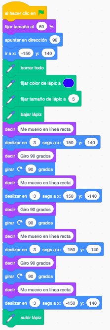
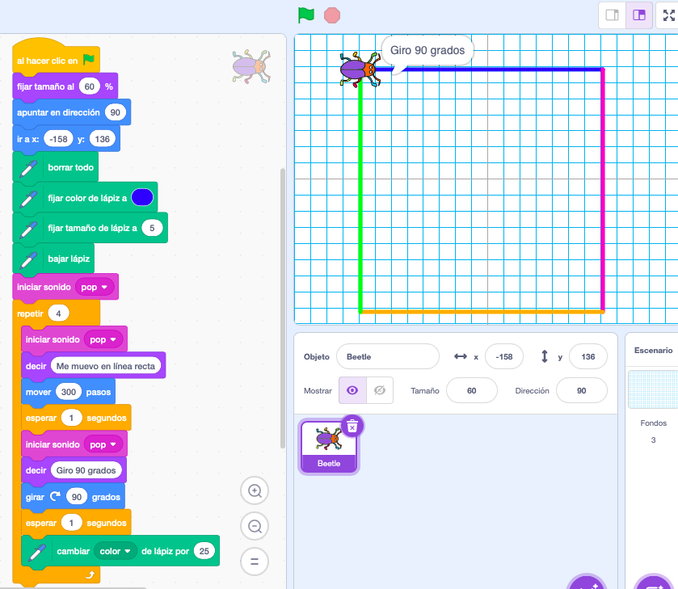
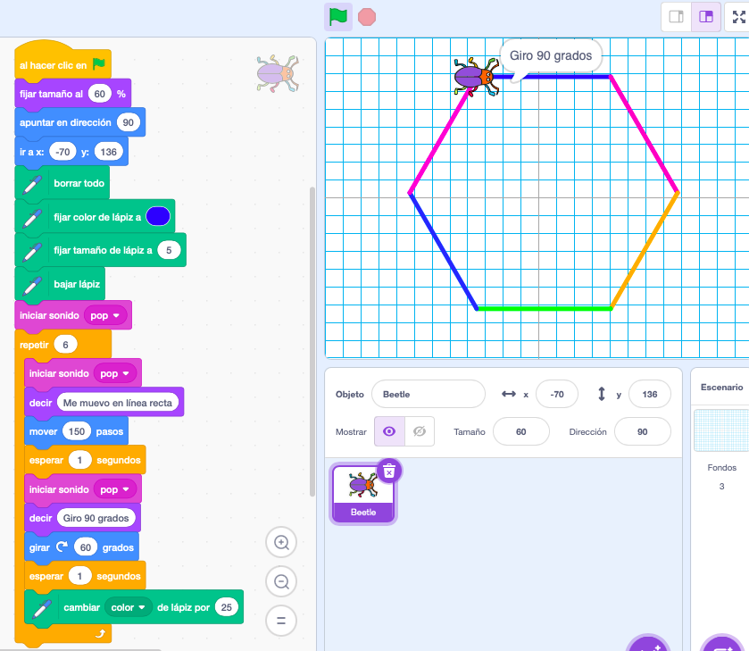
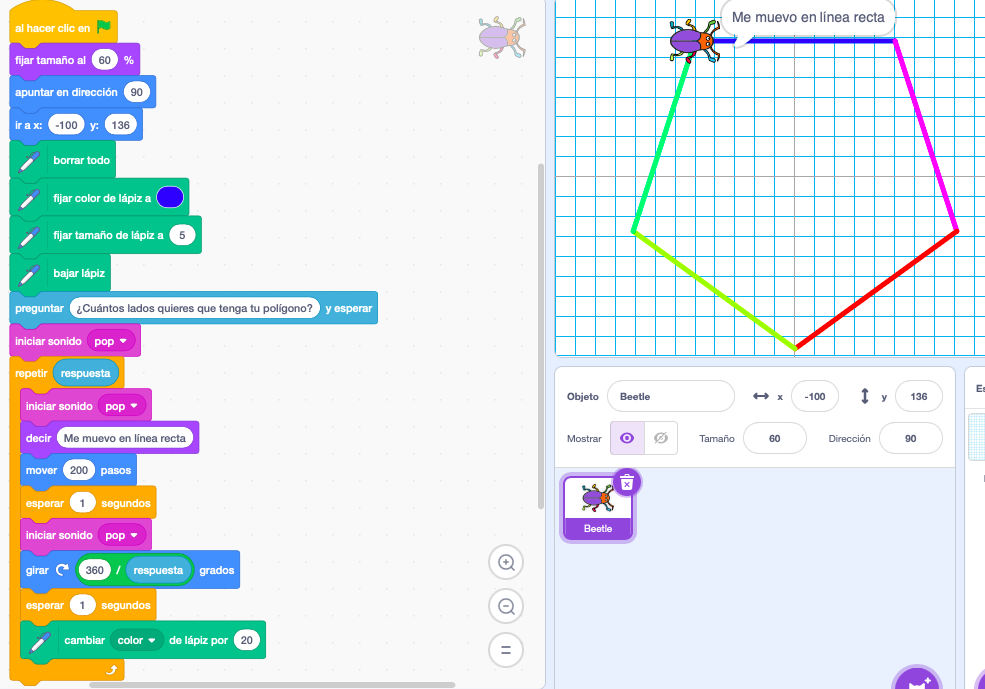
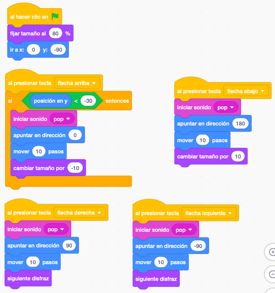
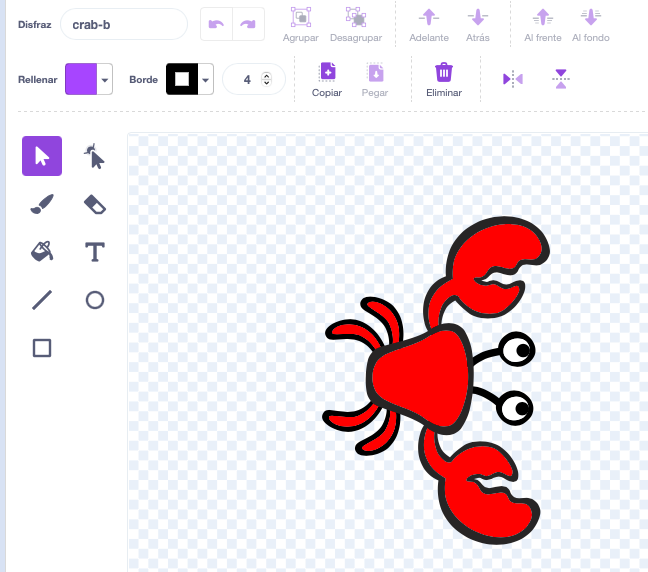

# Programación con scratch

Todos los proyectos que trabajamemos están en el [estudio del curso](https://scratch.mit.edu/studios/34051035)

## Reaprovechando un proyecto ya hecho: pasapalabra

Realizamos una copia de pasapalabra, cambiando las preguntas y las respuestas. También cambiamos el personaje central y los mensajes que nos envía al comenzar

## Dibujamos una figura

Vamos a posicionar nuestro personaje en varios puntos para que nos dibuje un figura geométrica, entre ellos lo iremos girando y usaremos el bloque deslizar para que haga los movimientos despacio

Primero movemos el personaje a un punto y luego añadimos los bloques de movimiento "deslizar" para que dibuje los lados

Para que el personaje deje restro dibujando añadimos la extensión  Lápiz

[Figura geométrica](https://scratch.mit.edu/projects/909884022)

## Dibujamos un cuadrado

Dibujar un polígono es una tarea repetitiva, para ello podemos utilizar la función de bucle incluyendo dentro el desplazamiento y el giro del ángulo correspondiente

Utilizaremos el bloque de bucle para repetir 4 veces el movimiento y el giro.

[programa](https://scratch.mit.edu/projects/909903881)

Si queremos dibujar otro polígono sólo tendremos que cambiar el número de repeticiones y los grados de giro. 

Así para un hexágono:

[Programa](https://scratch.mit.edu/projects/909914286)

## Dibujamos un polígono del número de lados que nos diga el usuario

Dibujamos un polígono del número de lados que nos diga el usuario al que se lo preguntamos

Usamos la extensión "Lápiz"

[polígono](https://scratch.mit.edu/projects/909916426)

## Control de movimiento con teclas

Controlamos un personaje (cangrejo) con las teclas de las flechas del cursor. [Moviendo un cangrejo por pantalla controlado por teclas](https://scratch.mit.edu/projects/909924810)

Con algunos personajes es necesario girar el disfraz para que se ajuste la orientación

También podemos seleccionar el tipo de giro que hará el disfraz del personaje, giro total, sólo izquierda o derecha (para disfraces con vista lateral como el oso o el centauro) o nada de giro

